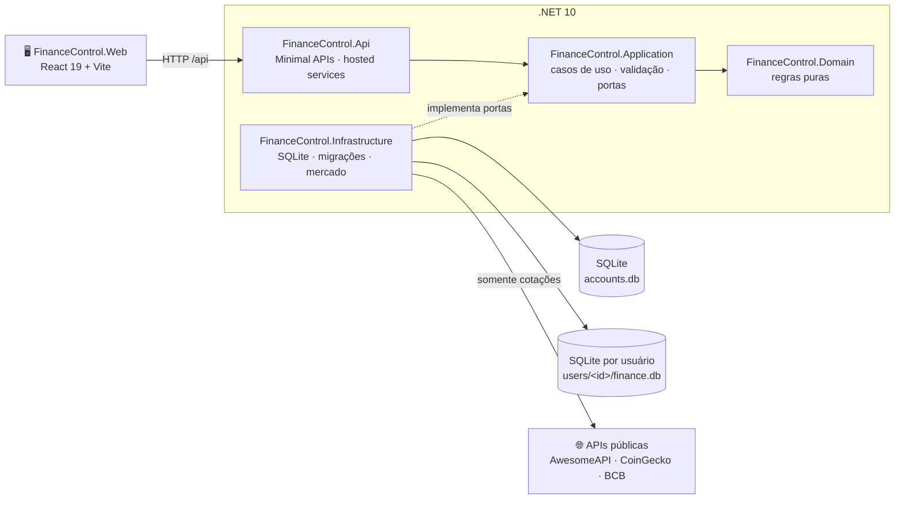

<div align="center">

# 💰 LMM Finance Control

**Controle financeiro pessoal local-first — seus dados ficam no seu computador.**

Lançamentos, contas a pagar, cartões e faturas, metas, investimentos, múltiplas moedas, relatórios, projeções e o plano **70-20-10**, numa interface moderna, acessível e instalável. Funciona só no seu computador ou como **servidor na rede de casa**, com **login e dados separados por usuário**.

[](https://dotnet.microsoft.com/)
[](https://react.dev/)
[](https://www.typescriptlang.org/)
[](https://vite.dev/)
[](https://sqlite.org/)
[](LICENSE)

[Funcionalidades](#-funcionalidades) · [Começando](#-começando) · [Contas](#-contas-de-usuário-e-segurança) · [Servidor local](#-servidor-na-rede-local-windows) · [Tecnologia](#-tecnologia) · [Arquitetura](#-arquitetura) · [APIs](#-apis) · [Privacidade](#-dados-e-privacidade) · [Documentação](#-documentação)

</div>

---

## ✨ Funcionalidades

### O dia a dia
- **Painel personalizável** — saldo do mês, teto de gastos, ritmo de gastos, fluxo de 6 meses, gastos por categoria, orçamento, próximos vencimentos (contas e faturas), metas, formas de pagamento e plano. Widgets podem ser reordenados, ocultados e restaurados.
- **Lançamentos** — receitas, despesas e investimentos com categoria, conta, forma de pagamento e moeda; agrupados por dia, com ações em lote (categorizar, remover) e **Desfazer** em tudo.
- **Contas a pagar** — checklist mensal com status claros ("Vence em 28/09 (10 dias)", "Vencida há 3 dias"), débito automático e faturas de cartão vencidas na mesma lista.
- **Cartões e faturas** — ciclo de fechamento/vencimento, fatura atual, fechadas e futuras, pagamento por conta bancária e limite usado.
- **Assinaturas** — Netflix, academia, Amazon… com equivalente mensal em reais, cobrança pendente e lançamento com um toque.
- **Contas bancárias** — saldo atual, extrato com "Saldo após", o que ainda vai ser debitado no mês e saldo projetado.
- **Metas e investimentos** — aportes, resgates, histórico estornável, alocação por tipo/liquidez e rendimento estimado ("Rende 110% do CDI ≈ 11,7% ao ano").
- **Fechar mês** — lista as pendências e congela o mês; alterações com data nele ficam bloqueadas até reabri-lo.

### Planejamento
- **Plano 70-20-10** sugerido no setup: 70% para gastos fixos (um *limite*, não uma meta), 20% para lazer e no mínimo 10% investidos, reserva de emergência de 6 salários e **Número da liberdade** de 150 salários. Aplicar o plano mostra o teto antes → depois, vincula as metas sem duplicar e pode criar as categorias-balde.
- **Relatórios** — receitas × despesas, categorias, maiores gastos, formas de pagamento, evolução do patrimônio, exposição cambial e realizado × plano; exportação CSV e impressão.
- **Projeções** — cenários de patrimônio com aporte, rendimento e marcos (reserva, Número da liberdade), com faixa de ±20% do CDI.
- **Mercado** — cotações e indicadores atualizados automaticamente, conversor e cotação manual.

### Contas e acesso
- **Um login por pessoa** — cadastro livre na tela de entrada; cada usuário tem o próprio banco e vê apenas os próprios dados, inclusive backup e restauração.
- **Servidor na rede de casa** — um computador roda a aplicação e os outros PCs e celulares da mesma rede acessam pelo navegador (e instalam como app).
- **Sessão de 30 dias** renovada com o uso, com **Sair** em Configurações → Conta.

### Experiência
- **Rápido de usar** — `Novo lançamento` em qualquer tela (botão, `+` no celular ou tecla `N`) e paleta de comandos `Ctrl K` com páginas, ações e recentes.
- **Customizável** — 5 temas (noite, esmeralda, ouro, grafite, claro), acentos, densidade confortável/compacta, animações e **ocultar valores** com um clique.
- **Várias moedas** — BRL, USD, EUR, GBP, JPY, CHF, CAD, AUD, ARS, BTC, ETH, SOL e USDT; totais convertidos para real e moedas sem cotação sinalizadas em vez de contarem como zero.
- **Resiliente** — sem conexão com o servidor local, um único aviso aparece no topo, as gravações ficam bloqueadas, nada é mostrado como R$ 0,00 falso e as telas recarregam sozinhas quando ele volta.
- **Acessível e responsivo** — navegação por teclado, leitor de tela (gráficos SVG com resumo textual), alvos de toque de 44 px, dock inferior no celular e `prefers-reduced-motion`.
- **Instalável** — PWA com manifest e ícones; a fonte Inter é empacotada localmente.
- **Primeiros passos guiados** — setup opcional, tour interativo e dados de exemplo apenas como sugestão (nunca gravados).

---

## 🚀 Começando

### Pré-requisitos

| Ferramenta | Versão |
|---|---|
| [.NET SDK](https://dotnet.microsoft.com/download/dotnet/10.0) | 10.0 |
| [Node.js](https://nodejs.org/) | 20.19+ ou 22.12+ |
| npm | 10+ |

### Em desenvolvimento

```bash
npm install
npm run dev
```

- Interface: <http://localhost:5173> (o Vite encaminha `/api` para a API)
- API: <http://localhost:5074>

Na primeira execução os bancos são criados e migrados automaticamente — não há nada para configurar. Ao abrir a interface, use **Criar conta**: cada conta começa vazia.

### Aplicação integrada

API e interface no mesmo processo:

```bash
npm run build
npm start
```

Disponível em <http://localhost:5074>.

### Scripts

| Comando | O que faz |
|---|---|
| `npm run dev` | API + interface com recarga automática |
| `npm run dev:api` / `npm run dev:web` | cada parte separadamente |
| `npm run build` | build da interface e da solução .NET em `Release` |
| `npm start` | executa a aplicação integrada |
| `npm test` | testes do frontend (Vitest) e do backend (xUnit) |
| `npm run lint` | ESLint com zero avisos |
| `npm run check` | lint + testes + builds — o portão de qualidade |

### Configuração

A configuração fica em [`src/FinanceControl.Api/appsettings.json`](src/FinanceControl.Api/appsettings.json).

| Chave | Padrão | Descrição |
|---|---|---|
| `Database:Directory` | `data` | pasta de dados, relativa ao diretório do processo (com os scripts npm: `src/FinanceControl.Api/Data`) |
| `DATA_DIRECTORY` (variável de ambiente) | — | sobrescreve a pasta de dados |
| `Market:RefreshHours` | `6` | intervalo da atualização automática de cotações (para cada usuário) |
| `Urls` | `http://localhost:5074` | endereço em que o servidor escuta |
| `AllowedHosts` | `localhost;127.0.0.1;[::1]` | nomes aceitos no endereço (proteção contra *DNS rebinding*) |

Qualquer chave pode ser sobrescrita por variável de ambiente com o mesmo nome (use `__` no lugar de `:`, como `Market__RefreshHours`):

```powershell
$env:DATA_DIRECTORY = "D:\FinanceControl\dados"
$env:Market__RefreshHours = "12"
npm run dev:api
```

Conteúdo da pasta de dados:

```text
data/
  accounts.db              usuários (nome e hash da senha) — nunca dados financeiros
  keys/                    chaves que cifram o cookie de sessão (protegidas pelo DPAPI no Windows)
  users/<id>/finance.db    banco financeiro de cada usuário
  users/<id>/backups/      cópias automáticas antes de restaurar um backup
```

O caminho do banco do usuário conectado aparece em **Configurações → Cópia de segurança** e em `GET /api/about`.

---

## 🔐 Contas de usuário e segurança

Toda a API exige login, com exceção de `GET /api/health` e das rotas de entrada. A interface abre na tela **Entrar**, onde qualquer pessoa pode **Criar conta** (cadastro livre).

**Como os dados são separados.** Cada usuário tem um **arquivo SQLite próprio** (`users/<id>/finance.db`). O isolamento é físico: nenhuma consulta de um usuário alcança o arquivo de outro, e ids de registros de outra pessoa simplesmente não existem para quem não é dono (respondem 404). Backup, restauração, fechamento de mês, cotações e débito automático funcionam por usuário.

| Regra | Valor |
|---|---|
| Usuário | 3 a 32 caracteres: letras minúsculas, números, `.`, `-` e `_` (maiúsculas são convertidas; `Ana` e `ana` são o mesmo usuário) |
| Senha | 8 a 128 caracteres |
| Sessão | 30 dias, renovada a cada uso; **Configurações → Conta → Sair** encerra a sessão no dispositivo |

**Proteções aplicadas**

| Proteção | Detalhe |
|---|---|
| Senhas | hash PBKDF2-SHA256 com 600.000 iterações e sal aleatório; a senha nunca é gravada |
| Cookie de sessão | `HttpOnly` (inacessível a scripts), `SameSite=Strict`, cifrado com chaves persistidas na pasta de dados |
| Login | mensagem única "Usuário ou senha inválidos." e tempo de resposta igual para usuário inexistente (não revela quem tem conta) |
| Força bruta | no máximo 10 tentativas de login ou cadastro por minuto por endereço IP (depois: `429` e `Retry-After: 60`) |
| CSRF | toda requisição que altera dados exige o cabeçalho `X-Requested-With: FinanceControl`, que páginas de outros sites não conseguem enviar |
| Sessões revogáveis | cada sessão carrega o carimbo de segurança do usuário; se ele mudar no banco de contas, as sessões existentes deixam de valer |
| Cabeçalhos | `X-Content-Type-Options: nosniff`, `X-Frame-Options: DENY`, `Referrer-Policy: no-referrer` e `Cache-Control: no-store` em toda a API |
| Nomes aceitos | `AllowedHosts` restringe os nomes do endereço (*DNS rebinding*) |

> **Atualizando de uma versão sem login?** O `finance.db` antigo fica intacto na pasta de dados, mas sem dono: cada conta nova começa vazia. Para levar os dados antigos para a sua conta, crie a conta, **pare o servidor** e copie o arquivo para a pasta dela. O id da conta é o número que aparece no caminho em **Configurações → Cópia de segurança**. Exemplo para a conta 1, com a pasta de dados padrão:
>
> ```powershell
> deploy\servidor-local\parar.cmd
> $dados = "src\FinanceControl.Api\Data"
> Copy-Item "$dados\finance.db" "$dados\users\1\finance.db" -Force
> if (Test-Path "$dados\finance.db-wal") { Copy-Item "$dados\finance.db-wal" "$dados\users\1\finance.db-wal" -Force } else { Remove-Item "$dados\users\1\finance.db-wal" -ErrorAction SilentlyContinue }
> Remove-Item "$dados\users\1\finance.db-shm" -ErrorAction SilentlyContinue
> ```
>
> Outra opção: exporte o **JSON** na versão antiga e use **Restaurar JSON** na conta nova.

---

## 🏠 Servidor na rede local (Windows)

Um computador da casa roda a aplicação; os outros PCs e os celulares **da mesma rede** acessam pelo navegador, cada pessoa com a própria conta. Os scripts ficam em [`deploy/servidor-local`](deploy/servidor-local).

### 1. Preparar o computador servidor (uma vez)

Instale as ferramentas (PowerShell):

```powershell
winget install --id Microsoft.DotNet.SDK.10 -e
winget install --id OpenJS.NodeJS.LTS -e
winget install --id Git.Git -e
```

Feche e abra o terminal e confira:

```powershell
dotnet --version   # 10.x
node --version     # 20.19+ ou 22.12+
```

Baixe o projeto e publique a aplicação (gera `deploy\servidor-local\app`, fora do Git):

```powershell
git clone https://github.com/lucasmolc/FinanceControl.git C:\Projects\FinanceControl
cd C:\Projects\FinanceControl
deploy\servidor-local\publicar.cmd
```

### 2. Configurar (opcional)

Edite [`deploy/servidor-local/servidor.conf`](deploy/servidor-local/servidor.conf):

| Chave | Padrão | Descrição |
|---|---|---|
| `PORTA` | `5074` | porta HTTP |
| `DADOS` | vazio = `src\FinanceControl.Api\Data` (a mesma do `npm run dev`) | pasta de dados, em caminho absoluto |
| `HOSTS_EXTRAS` | vazio | nomes extras aceitos no endereço, separados por `;` |

Exemplo:

```ini
PORTA=5074
DADOS=D:\FinanceControl\dados
HOSTS_EXTRAS=mol.local;mol.lan;financas.casa
```

Localhost, o nome do computador e os IPs atuais já são aceitos automaticamente. Use `HOSTS_EXTRAS` só para nomes que você digita no navegador e que não são esses, como os sufixos do roteador (`mol.lan`), o mDNS (`mol.local`) ou um nome criado no DNS do roteador (`financas.casa`). Um nome fora da lista recebe **400 Bad Request**. Não use `*`: isso desliga a proteção contra *DNS rebinding*.

### 3. Liberar o firewall (uma vez, PowerShell como administrador)

A rede de casa precisa estar como **Privada**:

```powershell
Get-NetConnectionProfile
```

Se a sua rede aparecer como `Public`, troque (use o `Name` mostrado acima):

```powershell
Set-NetConnectionProfile -Name "NOME-DA-REDE" -NetworkCategory Private
```

Libere a porta **somente para a rede local** e **somente no perfil Privado** (VPNs e redes públicas continuam bloqueadas):

```powershell
New-NetFirewallRule -DisplayName "LMM Finance Control" -Direction Inbound -Protocol TCP -LocalPort 5074 -RemoteAddress LocalSubnet -Profile Private -Action Allow
```

Se, na primeira execução, o Windows perguntou sobre o `FinanceControl.Api.exe` e você clicou em **Cancelar**, ele criou uma regra de **bloqueio**, que vence a regra acima. Confira e remova:

```powershell
Get-NetFirewallRule | Where-Object DisplayName -like "*FinanceControl*" | Select-Object DisplayName, Action, Profile, Enabled
Get-NetFirewallRule | Where-Object { $_.DisplayName -like "*FinanceControl*" -and $_.Action -eq "Block" } | Remove-NetFirewallRule
```

Trocou a `PORTA`? Crie a regra com a nova porta em `-LocalPort`.

### 4. Iniciar

| Script (em `deploy\servidor-local`) | O que faz |
|---|---|
| `iniciar.cmd` | inicia com uma janela de terminal e logs visíveis (`Ctrl+C` para parar) |
| `segundo-plano.cmd` | inicia sem janela; logs em `servidor.log` e `servidor-erros.log` (recriados a cada início) |
| `parar.cmd` | encerra o servidor publicado (não afeta o `npm run dev`) |
| `adicionar-inicializacao.cmd` | inicia em segundo plano sempre que você entrar no Windows (atalho na pasta Inicializar) |
| `remover-inicializacao.cmd` | desfaz o anterior |
| `publicar.cmd` | compila a interface e publica a aplicação em `app\` |

Uso típico: rodar em segundo plano e iniciar com o Windows:

```powershell
deploy\servidor-local\adicionar-inicializacao.cmd
deploy\servidor-local\segundo-plano.cmd
```

Nenhum script precisa de administrador. Ao iniciar, os endereços de acesso aparecem no início do log (`iniciar.cmd` ou `servidor.log`):

```text
Neste computador: http://localhost:5074
Em outro PC da rede: http://MOL:5074
No celular (use o IP da rede Wi-Fi):
  http://192.168.1.15:5074  (Ethernet)
```

### 5. Acessar

| De onde | Endereço |
|---|---|
| O próprio servidor | `http://localhost:5074` |
| Outro computador Windows | `http://NOME-DO-PC:5074` ou `http://IP-DO-PC:5074` |
| **Celular** | **`http://IP-DO-PC:5074`**. Android e iPhone não resolvem o nome do PC; use o IP |

No primeiro acesso, cada pessoa toca em **Criar conta**. No celular, o menu do navegador oferece **Adicionar à tela inicial** (PWA). O `0.0.0.0` que aparece no log é o endereço de escuta, não um endereço para abrir.

Para o IP não mudar, reserve-o no roteador (DHCP → reserva de endereço para o PC servidor). Se o IP mudar, reinicie o servidor: a lista de endereços aceitos é montada ao iniciar.

### 6. Manter o servidor no ar

Bloquear a tela (`Win+L`) ou deixar o monitor desligar **não** interrompe o servidor. O que interrompe:

| Situação | Servidor continua? |
|---|---|
| Tela bloqueada ou monitor desligado | ✅ sim |
| Suspensão ou hibernação (automática ou ao fechar a tampa) | ❌ não |
| Sair da conta ou reiniciar | ❌ não, até entrar de novo (com `adicionar-inicializacao.cmd`, ele volta sozinho) |

Para não suspender quando o computador estiver na tomada:

```powershell
powercfg /change standby-timeout-ac 0
powercfg /change hibernate-timeout-ac 0
```

Em notebooks, ajuste também **Painel de Controle → Opções de energia → Escolher a função do fechamento da tampa → Conectado: Não fazer nada**. Para conferir, bloqueie o computador e abra o endereço pelo celular.

### 7. Atualizar para uma versão nova

```powershell
cd C:\Projects\FinanceControl
deploy\servidor-local\parar.cmd
git pull
deploy\servidor-local\publicar.cmd
deploy\servidor-local\segundo-plano.cmd
```

As migrações dos bancos rodam sozinhas ao iniciar. Antes de atualizar, vale exportar um backup em **Configurações → Cópia de segurança** (cada usuário exporta o seu) ou copiar a pasta de dados inteira com o servidor parado:

```powershell
deploy\servidor-local\parar.cmd
Copy-Item "C:\Projects\FinanceControl\src\FinanceControl.Api\Data" "D:\Backup\FinanceControl-$(Get-Date -Format yyyy-MM-dd)" -Recurse
```

### 8. Problemas comuns

| Sintoma | Causa provável | Solução |
|---|---|---|
| Funciona nos PCs, não no celular | o celular não resolve o nome do PC | use `http://IP-DO-PC:5074` |
| Celular não conecta nem pelo IP | celular em outra rede (Wi-Fi de visitantes, repetidor com outra faixa de IP, dados móveis) | conecte à mesma rede do PC; compare o início do IP do celular com o do PC |
| Tempo esgotado em todos os dispositivos | firewall ou rede como Pública | passo 3: perfil `Private`, regra de liberação e regras de bloqueio |
| **400 Bad Request** | nome digitado fora da lista de aceitos | acrescente em `HOSTS_EXTRAS` e reinicie |
| Pede login de novo | sessão expirada (30 dias sem uso) ou encerrada | entre novamente |
| **429** / "Muitas tentativas seguidas" | mais de 10 tentativas de login por minuto | aguarde um minuto |
| Janela abre e fecha / "porta já em uso" | `npm run dev` ou outro servidor usando a porta | `parar.cmd`, feche o outro ou troque a `PORTA` |
| Não conecta com a VPN ligada | a VPN bloqueia a rede local | desconecte a VPN; o acesso é somente pela rede local |

### Desfazer tudo

```powershell
deploy\servidor-local\parar.cmd
deploy\servidor-local\remover-inicializacao.cmd
Remove-NetFirewallRule -DisplayName "LMM Finance Control"   # como administrador
```

> **Segurança:** mesmo com login, o servidor usa HTTP sem criptografia e foi feito para a rede de casa. **Nunca encaminhe a porta no roteador** nem o exponha na internet. Para acessar de fora de casa, use uma VPN própria (como Tailscale ou WireGuard) em vez de abrir a porta.

---

## 🧰 Tecnologia

| Camada | Tecnologias |
|---|---|
| **Backend** | ASP.NET Core Minimal APIs (.NET 10 LTS), autenticação por cookie, limite de tentativas (`RateLimiter`), Data Protection, `TimeProvider`, serviços em segundo plano (cotações e débito automático), ProblemDetails, OpenAPI |
| **Dados** | SQLite (WAL) com `Microsoft.Data.Sqlite` e Dapper, um banco por usuário mais o banco de contas, migrações SQL versionadas e aditivas |
| **Frontend** | React 19, TypeScript estrito, Vite 7, rotas por hash, páginas carregadas sob demanda |
| **Interface** | biblioteca de componentes própria (30+ componentes), gráficos SVG próprios, ícones [Lucide](https://lucide.dev/), fonte [Inter](https://rsms.me/inter/) local, CSS em *cascade layers* com tokens e temas |
| **Qualidade** | xUnit + `WebApplicationFactory`, Vitest + Testing Library, ESLint 9 com `--max-warnings 0` |

Dependências de runtime do frontend: apenas `react`, `react-dom`, `lucide-react` e `@fontsource-variable/inter`.

---

## 🏗️ Arquitetura

Arquitetura hexagonal: o domínio não conhece banco nem HTTP, e cada adaptador depende apenas das portas da aplicação.



**Regras de domínio que valem para todo o sistema**
- Dinheiro em inteiros (centavos) na moeda do registro; totais convertidos para BRL.
- Datas ISO (`AAAA-MM-DD`), meses `AAAA-MM`.
- Remoções lógicas com **Desfazer**; movimentações de saldo atômicas e estornáveis.
- Mês fechado bloqueia alterações com data nele.

```text
src/
  FinanceControl.Domain/          regras puras (saldos, faturas, moedas, plano, débito automático)
  FinanceControl.Application/     casos de uso, validação de entrada e portas
  FinanceControl.Infrastructure/  adaptador SQLite, migrações e fontes de mercado
  FinanceControl.Api/             endpoints HTTP, serviços em segundo plano e composição
  FinanceControl.Web/
    src/components/ui/            biblioteca de componentes (uma pasta por componente)
    src/components/charts/        gráficos SVG acessíveis
    src/features/                 páginas e modelos por funcionalidade
    src/styles/                   CSS em camadas (theme → base → app → components → adapt)
tests/FinanceControl.Api.Tests/   domínio, migrações e integração HTTP
docs/                             arquitetura, API, migrações e histórico de melhorias
```

---

## 🔌 APIs

### APIs públicas consumidas

Chamadas **somente pelo backend**, sem chave e **sem enviar nenhum dado do usuário** — apenas os códigos das moedas e das séries.

| Serviço | Uso |
|---|---|
| [AwesomeAPI](https://docs.awesomeapi.com.br/api-de-moedas) | cotações de moedas e cripto em BRL (fonte principal) |
| [CoinGecko](https://www.coingecko.com/en/api) | cotação de criptomoedas (reserva) |
| [Banco Central — SGS](https://dadosabertos.bcb.gov.br/) | Selic (432), CDI (4389), IPCA 12 meses (13522) e IPCA do mês (433) |

Os valores ficam salvos no banco, então o app continua funcionando sem internet com a última cotação conhecida (ou uma cotação manual).

### API HTTP local

Documentação completa em [docs/API.md](docs/API.md). Principais rotas:

| Área | Rotas |
|---|---|
| Conta | `POST /api/auth/register`, `POST /api/auth/login`, `POST /api/auth/logout`, `GET /api/auth/me` |
| Leitura agregada | `GET /api/state`, `GET /api/summary?month=`, `GET /api/about`, `GET /api/health` |
| Registros (CRUD) | `GET/POST/PUT/DELETE /api/{módulo}` e `POST /api/{módulo}/{id}/restore` — lançamentos, categorias, contas a pagar, contas bancárias, cartões, assinaturas, metas e investimentos |
| Contas e faturas | `GET/POST /api/checklist`, `GET /api/card-invoices?month=`, `GET /api/cards/{id}/invoices`, `POST /api/cards/{id}/invoices/{mês}/pay`, `POST /api/subscriptions/{id}/charge` |
| Movimentações | aportes/resgates de metas e investimentos, depósitos e transferências bancárias, extratos e estornos |
| Mês | `POST /api/months/{AAAA-MM}/close`, `POST /api/months/{AAAA-MM}/reopen`, `GET /api/months/closings` |
| Planejamento | `POST /api/setup`, `POST/DELETE /api/plan`, `PUT /api/settings`, `POST /api/settings/emergency-goal` e `/freedom-goal` |
| Análises | `GET /api/reports` (+ CSV), `GET /api/projections/base`, `GET /api/market`, `POST /api/market/refresh`, `PUT /api/market/rates/{moeda}` |
| Backup | `GET /api/backup`, `GET /api/backup/database`, `POST /api/backup/restore` |

Todas as rotas, exceto `GET /api/health` e as de conta, exigem sessão (`401` sem ela); as que alteram dados exigem também o cabeçalho `X-Requested-With: FinanceControl`. Erros seguem ProblemDetails, com o campo inválido e a mensagem em português.

---

## 🔒 Dados e privacidade

- **Local-first:** tudo fica em arquivos SQLite no computador que roda a aplicação. Nenhum dado financeiro sai da máquina (a rede local só transporta as telas até os seus dispositivos).
- **Por usuário:** cada conta tem o próprio arquivo de banco; o banco de contas guarda só nome de usuário e hash da senha.
- **Não versionado:** bancos, WAL/SHM, `users/`, `keys/` e backups são ignorados pelo git.
- **Rede de casa, não internet:** por padrão só `localhost` é aceito; o servidor local abre para a rede com os scripts de [`deploy/servidor-local`](#-servidor-na-rede-local-windows). **Não o exponha na internet.**
- **Cópia de segurança** em **Configurações → Cópia de segurança** (sempre da conta conectada):
  - **Exportar JSON** — todos os dados em formato legível;
  - **Baixar banco** — cópia SQLite consistente;
  - **Restaurar JSON** — substitui os dados atuais, gravando antes uma cópia automática em `users/<id>/backups/`.

---

## ✅ Qualidade

- **748 testes** no frontend e **366** no backend (incluindo autenticação, isolamento entre usuários e as proteções da API), com `npm run check` verde e zero avisos.
- Migrações aditivas e testadas sobre bancos reais (atual: `009_bill_active_since`).
- Interface avaliada em quatro rodadas de crítica de design (heurísticas de usabilidade, acessibilidade e responsividade) — notas e histórico em [docs/MELHORIAS.md](docs/MELHORIAS.md).

---

## 📚 Documentação

| Documento | Conteúdo |
|---|---|
| [ARCHITECTURE.md](docs/ARCHITECTURE.md) | camadas, portas e decisões |
| [API.md](docs/API.md) | todas as rotas, formatos e erros |
| [MIGRATIONS.md](docs/MIGRATIONS.md) | histórico do esquema do banco |
| [MELHORIAS.md](docs/MELHORIAS.md) | rodadas de melhoria e notas de cada tela |
| [DESIGN.md](src/FinanceControl.Web/DESIGN.md) | sistema de design: tokens, componentes e movimento |

---

## 📄 Licença

Distribuído sob a licença [MIT](LICENSE). © 2026 Lucas Mol.
