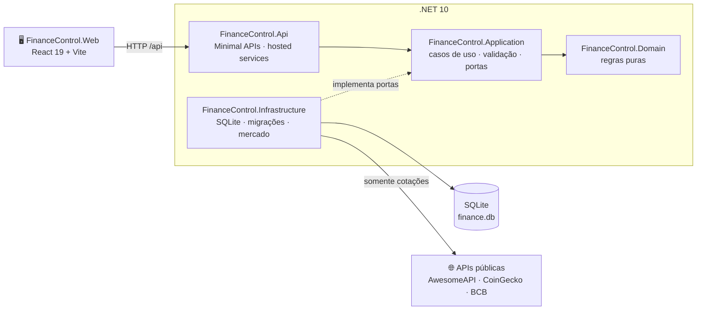

<div align="center">

# 💰 LMM Finance Control

**Controle financeiro pessoal local-first — seus dados ficam no seu computador.**

Lançamentos, contas a pagar, cartões e faturas, metas, investimentos, múltiplas moedas, relatórios, projeções e o plano **70-20-10**, numa interface moderna, acessível e instalável.

[](https://dotnet.microsoft.com/)
[](https://react.dev/)
[](https://www.typescriptlang.org/)
[](https://vite.dev/)
[](https://sqlite.org/)
[](LICENSE)

[Funcionalidades](#-funcionalidades) · [Começando](#-começando) · [Tecnologia](#-tecnologia) · [Arquitetura](#-arquitetura) · [APIs](#-apis) · [Privacidade](#-dados-e-privacidade) · [Documentação](#-documentação)

</div>

---

## ✨ Funcionalidades

### O dia a dia
- **Painel personalizável** — saldo do mês, teto de gastos, ritmo de gastos, fluxo de 6 meses, gastos por categoria, orçamento, próximos vencimentos (contas e faturas), metas, formas de pagamento e plano. Widgets podem ser reordenados, ocultados e restaurados.
- **Lançamentos** — receitas, despesas e investimentos com categoria, conta, forma de pagamento e moeda; agrupados por dia, com ações em lote (categorizar, remover) e **Desfazer** em tudo.
- **Contas a pagar** — checklist mensal com status claros ("Vence em 28/09 (10 dias)", "Vencida há 3 dias"), débito automático e faturas de cartão vencidas na mesma lista.
- **Cartões e faturas** — ciclo de fechamento/vencimento, fatura atual, fechadas e futuras, pagamento por conta bancária e limite usado.
- **Assinaturas** — Netflix, academia, Amazon… com equivalente mensal em reais, cobrança pendente e lançamento com um toque.
- **Contas bancárias** — saldo atual, extrato com "Saldo após", o que ainda vai ser debitado no mês e saldo projetado.
- **Metas e investimentos** — aportes, resgates, histórico estornável, alocação por tipo/liquidez e rendimento estimado ("Rende 110% do CDI ≈ 11,7% ao ano").
- **Fechar mês** — lista as pendências e congela o mês; alterações com data nele ficam bloqueadas até reabri-lo.

### Planejamento
- **Plano 70-20-10** sugerido no setup: 70% para gastos fixos (um *limite*, não uma meta), 20% para lazer e no mínimo 10% investidos, reserva de emergência de 6 salários e **Número da liberdade** de 150 salários. Aplicar o plano mostra o teto antes → depois, vincula as metas sem duplicar e pode criar as categorias-balde.
- **Relatórios** — receitas × despesas, categorias, maiores gastos, formas de pagamento, evolução do patrimônio, exposição cambial e realizado × plano; exportação CSV e impressão.
- **Projeções** — cenários de patrimônio com aporte, rendimento e marcos (reserva, Número da liberdade), com faixa de ±20% do CDI.
- **Mercado** — cotações e indicadores atualizados automaticamente, conversor e cotação manual.

### Experiência
- **Rápido de usar** — `Novo lançamento` em qualquer tela (botão, `+` no celular ou tecla `N`) e paleta de comandos `Ctrl K` com páginas, ações e recentes.
- **Customizável** — 5 temas (noite, esmeralda, ouro, grafite, claro), acentos, densidade confortável/compacta, animações e **ocultar valores** com um clique.
- **Várias moedas** — BRL, USD, EUR, GBP, JPY, CHF, CAD, AUD, ARS, BTC, ETH, SOL e USDT; totais convertidos para real e moedas sem cotação sinalizadas em vez de contarem como zero.
- **Resiliente** — sem conexão com o servidor local, um único aviso aparece no topo, as gravações ficam bloqueadas, nada é mostrado como R$ 0,00 falso e as telas recarregam sozinhas quando ele volta.
- **Acessível e responsivo** — navegação por teclado, leitor de tela (gráficos SVG com resumo textual), alvos de toque de 44 px, dock inferior no celular e `prefers-reduced-motion`.
- **Instalável** — PWA com manifest e ícones; a fonte Inter é empacotada localmente.
- **Primeiros passos guiados** — setup opcional, tour interativo e dados de exemplo apenas como sugestão (nunca gravados).

---

## 🚀 Começando

### Pré-requisitos

| Ferramenta | Versão |
|---|---|
| [.NET SDK](https://dotnet.microsoft.com/download/dotnet/10.0) | 10.0 |
| [Node.js](https://nodejs.org/) | 20.19+ ou 22.12+ |
| npm | 10+ |

### Em desenvolvimento

```bash
npm install
npm run dev
```

- Interface: <http://localhost:5173> (o Vite encaminha `/api` para a API)
- API: <http://localhost:5074>

Na primeira execução o banco é criado e migrado automaticamente — não há nada para configurar.

### Aplicação integrada

API e interface no mesmo processo:

```bash
npm run build
npm start
```

Disponível em <http://localhost:5074>.

### Scripts

| Comando | O que faz |
|---|---|
| `npm run dev` | API + interface com recarga automática |
| `npm run dev:api` / `npm run dev:web` | cada parte separadamente |
| `npm run build` | build da interface e da solução .NET em `Release` |
| `npm start` | executa a aplicação integrada |
| `npm test` | testes do frontend (Vitest) e do backend (xUnit) |
| `npm run lint` | ESLint com zero avisos |
| `npm run check` | lint + testes + builds — o portão de qualidade |

### Configuração

A configuração fica em [`src/FinanceControl.Api/appsettings.json`](src/FinanceControl.Api/appsettings.json).

| Chave | Padrão | Descrição |
|---|---|---|
| `Database:Path` | `data/finance.db` | caminho do banco, relativo ao diretório do processo (com os scripts npm: `src/FinanceControl.Api/Data/finance.db`) |
| `DATABASE_PATH` (variável de ambiente) | — | sobrescreve o caminho do banco |
| `Market:RefreshHours` | `6` | intervalo da atualização automática de cotações |
| `Urls` | `http://localhost:5074` | endereço da API |

```powershell
$env:DATABASE_PATH = "C:\dados\finance-control.db"
npm run dev:api
```

O caminho real em uso aparece em **Configurações → Cópia de segurança** e em `GET /api/about`.

### Servidor na rede local (Windows)

Para usar um computador como servidor e acessar pelo celular ou por outros PCs **da mesma rede**:

1. Publique: `deploy\servidor-local\publicar.cmd` (gera `deploy\servidor-local\app`, fora do Git).
2. Ajuste, se quiser, [`deploy/servidor-local/servidor.conf`](deploy/servidor-local/servidor.conf): `PORTA` (padrão `5074`), `BANCO` (vazio = o mesmo banco do `npm run dev`) e `HOSTS_EXTRAS`.
3. Libere a porta só para a rede local, uma vez, no PowerShell **como administrador** (a rede do Windows precisa estar como *Privada*):
   ```powershell
   New-NetFirewallRule -DisplayName "LMM Finance Control" -Direction Inbound -Protocol TCP -LocalPort 5074 -RemoteAddress LocalSubnet -Profile Private -Action Allow
   ```
4. Inicie com `deploy\servidor-local\iniciar.cmd` e acesse `http://NOME-DO-PC:5074` pelos outros dispositivos. Para iniciar com o Windows, crie um atalho para o `iniciar.cmd` em `shell:startup`.

A aplicação **não tem login**: quem acessa a porta lê e altera todos os dados. Nunca encaminhe a porta no roteador. O `iniciar.cmd` aceita apenas localhost, o nome e os IPs atuais do computador (mais `HOSTS_EXTRAS`), o que bloqueia ataques de *DNS rebinding*. O servidor usa a mesma porta do `npm run dev`: rode um de cada vez. Para atualizar, pare o servidor (`Ctrl+C`) e publique de novo.

---

## 🧰 Tecnologia

| Camada | Tecnologias |
|---|---|
| **Backend** | ASP.NET Core Minimal APIs (.NET 10 LTS), `TimeProvider`, serviços em segundo plano (cotações e débito automático), ProblemDetails, OpenAPI |
| **Dados** | SQLite (WAL) com `Microsoft.Data.Sqlite` e Dapper, migrações SQL versionadas e aditivas |
| **Frontend** | React 19, TypeScript estrito, Vite 7, rotas por hash, páginas carregadas sob demanda |
| **Interface** | biblioteca de componentes própria (30+ componentes), gráficos SVG próprios, ícones [Lucide](https://lucide.dev/), fonte [Inter](https://rsms.me/inter/) local, CSS em *cascade layers* com tokens e temas |
| **Qualidade** | xUnit + `WebApplicationFactory`, Vitest + Testing Library, ESLint 9 com `--max-warnings 0` |

Dependências de runtime do frontend: apenas `react`, `react-dom`, `lucide-react` e `@fontsource-variable/inter`.

---

## 🏗️ Arquitetura

Arquitetura hexagonal: o domínio não conhece banco nem HTTP, e cada adaptador depende apenas das portas da aplicação.



**Regras de domínio que valem para todo o sistema**
- Dinheiro em inteiros (centavos) na moeda do registro; totais convertidos para BRL.
- Datas ISO (`AAAA-MM-DD`), meses `AAAA-MM`.
- Remoções lógicas com **Desfazer**; movimentações de saldo atômicas e estornáveis.
- Mês fechado bloqueia alterações com data nele.

```text
src/
  FinanceControl.Domain/          regras puras (saldos, faturas, moedas, plano, débito automático)
  FinanceControl.Application/     casos de uso, validação de entrada e portas
  FinanceControl.Infrastructure/  adaptador SQLite, migrações e fontes de mercado
  FinanceControl.Api/             endpoints HTTP, serviços em segundo plano e composição
  FinanceControl.Web/
    src/components/ui/            biblioteca de componentes (uma pasta por componente)
    src/components/charts/        gráficos SVG acessíveis
    src/features/                 páginas e modelos por funcionalidade
    src/styles/                   CSS em camadas (theme → base → app → components → adapt)
tests/FinanceControl.Api.Tests/   domínio, migrações e integração HTTP
docs/                             arquitetura, API, migrações e histórico de melhorias
```

---

## 🔌 APIs

### APIs públicas consumidas

Chamadas **somente pelo backend**, sem chave e **sem enviar nenhum dado do usuário** — apenas os códigos das moedas e das séries.

| Serviço | Uso |
|---|---|
| [AwesomeAPI](https://docs.awesomeapi.com.br/api-de-moedas) | cotações de moedas e cripto em BRL (fonte principal) |
| [CoinGecko](https://www.coingecko.com/en/api) | cotação de criptomoedas (reserva) |
| [Banco Central — SGS](https://dadosabertos.bcb.gov.br/) | Selic (432), CDI (4389), IPCA 12 meses (13522) e IPCA do mês (433) |

Os valores ficam salvos no banco, então o app continua funcionando sem internet com a última cotação conhecida (ou uma cotação manual).

### API HTTP local

Documentação completa em [docs/API.md](docs/API.md). Principais rotas:

| Área | Rotas |
|---|---|
| Leitura agregada | `GET /api/state`, `GET /api/summary?month=`, `GET /api/about`, `GET /api/health` |
| Registros (CRUD) | `GET/POST/PUT/DELETE /api/{módulo}` e `POST /api/{módulo}/{id}/restore` — lançamentos, categorias, contas a pagar, contas bancárias, cartões, assinaturas, metas e investimentos |
| Contas e faturas | `GET/POST /api/checklist`, `GET /api/card-invoices?month=`, `GET /api/cards/{id}/invoices`, `POST /api/cards/{id}/invoices/{mês}/pay`, `POST /api/subscriptions/{id}/charge` |
| Movimentações | aportes/resgates de metas e investimentos, depósitos e transferências bancárias, extratos e estornos |
| Mês | `POST /api/months/{AAAA-MM}/close`, `POST /api/months/{AAAA-MM}/reopen`, `GET /api/months/closings` |
| Planejamento | `POST /api/setup`, `POST/DELETE /api/plan`, `PUT /api/settings`, `POST /api/settings/emergency-goal` e `/freedom-goal` |
| Análises | `GET /api/reports` (+ CSV), `GET /api/projections/base`, `GET /api/market`, `POST /api/market/refresh`, `PUT /api/market/rates/{moeda}` |
| Backup | `GET /api/backup`, `GET /api/backup/database`, `POST /api/backup/restore` |

Erros seguem ProblemDetails, com o campo inválido e a mensagem em português.

---

## 🔒 Dados e privacidade

- **Local-first:** tudo fica em um arquivo SQLite no seu computador. Nenhum dado financeiro sai da máquina.
- **Não versionado:** o banco, WAL/SHM e `Data/backups/` são ignorados pelo git.
- **Uso local:** a aplicação não tem login e aceita apenas `localhost`. **Não a exponha na internet.**
- **Cópia de segurança** em **Configurações → Cópia de segurança**:
  - **Exportar JSON** — todos os dados em formato legível;
  - **Baixar banco** — cópia SQLite consistente;
  - **Restaurar JSON** — substitui os dados atuais, gravando antes uma cópia automática em `Data/backups/`.

---

## ✅ Qualidade

- **742 testes** no frontend e **342** no backend, com `npm run check` verde e zero avisos.
- Migrações aditivas e testadas sobre bancos reais (atual: `009_bill_active_since`).
- Interface avaliada em quatro rodadas de crítica de design (heurísticas de usabilidade, acessibilidade e responsividade) — notas e histórico em [docs/MELHORIAS.md](docs/MELHORIAS.md).

---

## 📚 Documentação

| Documento | Conteúdo |
|---|---|
| [ARCHITECTURE.md](docs/ARCHITECTURE.md) | camadas, portas e decisões |
| [API.md](docs/API.md) | todas as rotas, formatos e erros |
| [MIGRATIONS.md](docs/MIGRATIONS.md) | histórico do esquema do banco |
| [MELHORIAS.md](docs/MELHORIAS.md) | rodadas de melhoria e notas de cada tela |
| [DESIGN.md](src/FinanceControl.Web/DESIGN.md) | sistema de design: tokens, componentes e movimento |

---

## 📄 Licença

Distribuído sob a licença [MIT](LICENSE). © 2026 Lucas Mol.
